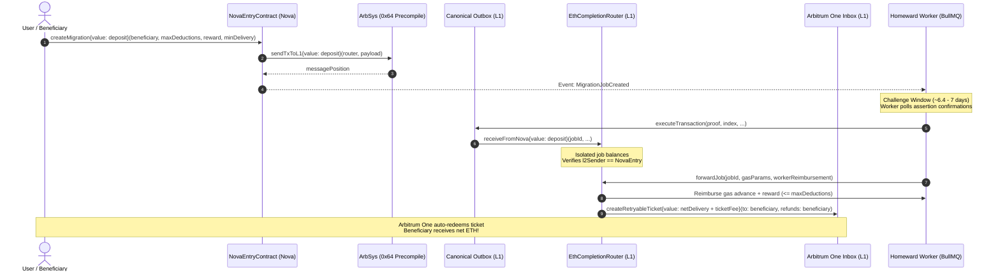

# Homeward 🏠

> **Self-service ETH migration protocol for Arbitrum Nova holders whose ETH is trapped on Nova.**

Homeward migrates ETH from Arbitrum Nova to Arbitrum One using the canonical path:
**Arbitrum Nova → Ethereum (L1) → Arbitrum One**

A gas-advancing TypeScript worker advances the migration at each step, compensated from user-authorized funds strictly within user-signed caps.

---

## 🏗️ Architecture



---

## 🔒 Security Invariants & Guarantees

1. **Non-Custodial Principal Isolation**:
   The worker EOA holds only its own operational gas funds — it **never** takes custody of user principal.
2. **Strict User-Signed Caps**:
   `totalDeductions = workerReimbursement + executorReward + retryableGasCost <= maxDeductions`.
   If a gas spike occurs on L1, the router reverts and emits `JobOverBudget`, prompting the worker to delay execution until base fees normalize rather than burning user funds.
3. **Guaranteed Minimum Delivery**:
   `netDeliveryAmount = deposit - totalDeductions >= minDeliveryThreshold`.
4. **Beneficiary-Guaranteed Refunds**:
   In `createRetryableTicket()`, both `excessFeeRefundAddress` and `callValueRefundAddress` are hardcoded to the `beneficiary`, never the worker EOA.
5. **Solvency & Storage Isolation**:
   Invariant tests verify across 128,000+ state calls that `address(router).balance == sum(jobBalances)`.
6. **14-Day Emergency Escape Hatch**:
   If the worker goes offline or stops advancing jobs, either the `depositor` or `beneficiary` can call `emergencyWithdraw(jobId)` on L1 to recover 100% of their deposited principal.

---

## 📦 Project Structure

```
homeward/
├── contracts/               # Foundry smart contracts & test suites
│   ├── src/
│   │   ├── NovaEntryContract.sol      # Deposit & bridge entrypoint on Nova
│   │   ├── EthCompletionRouter.sol    # L1 receiver, isolator & retryable dispatcher
│   │   └── interfaces/                # IArbSys, IOutbox, IInbox
│   ├── test/                          # Unit, fuzz, and invariant test suites
│   └── script/                        # Foundry deployment scripts
├── worker/                  # TypeScript worker service (BullMQ + Drizzle)
│   ├── src/
│   │   ├── queues/                    # discovery, monitoring, execution, retryable
│   │   ├── db/                        # Drizzle ORM schema & Postgres client
│   │   ├── config.ts                  # Zod validation & configuration
│   │   └── worker.ts                  # Multi-queue orchestrator
├── frontend/                # Next.js 14 Web Application
│   ├── src/
│   │   ├── app/                       # App Router, Layout, Providers, Globals
│   │   ├── components/                # Navbar, CreateMigration, JobTracker, Recovery
│   │   └── config/                    # Wagmi v2 & RainbowKit config
├── cli/                     # Self-service recovery CLI (tsx + commander)
│   └── src/index.ts                   # 6 recovery & inspection commands
├── docker-compose.yml       # Local PostgreSQL + Redis containers
├── .env.example             # Environment template
└── README.md
```

---

## 🚀 Getting Started

### 1. Prerequisites
- Node.js >= 18 (Tested on v26)
- Docker & Docker Compose (for PostgreSQL and Redis)
- Foundry (`forge` >= 0.2.0)

### 2. Start Supporting Services
```bash
# Starts Redis (port 6379) and PostgreSQL (port 5432)
docker compose up -d
```

### 3. Run Smart Contract Tests
```bash
cd contracts
forge test -vvv
```
*Runs all 14 unit, fuzz, and invariant solvency test suites.*

### 4. Run the Background Worker
```bash
cd worker
npm install
npm test       # Run worker calculation unit tests
npm run dev    # Start discovery & monitoring loop
```

### 5. Launch the Frontend
```bash
cd frontend
npm install
npm run dev    # Open http://localhost:3000
```

### 6. Using the Recovery CLI
```bash
cd cli
npx tsx src/index.ts --help

# Available Commands:
# 1. Inspect status:
npx tsx src/index.ts status <job-id>

# 2. Claim L1 Outbox if challenge period passed:
npx tsx src/index.ts claim-l1 <job-id> --nova-tx <tx-hash>

# 3. Manually forward job on L1:
npx tsx src/index.ts forward <job-id>

# 4. Check retryable ticket status on Arb One:
npx tsx src/index.ts retryable-status <ticket-id> --forward-tx <tx-hash>

# 5. Manually redeem retryable ticket on Arb One:
npx tsx src/index.ts retryable-redeem <ticket-id> --forward-tx <tx-hash>

# 6. Emergency withdraw after 14-day delay:
npx tsx src/index.ts emergency-withdraw <job-id>
```

---

## 🌐 Testnet Deployment Strategy

Because Arbitrum Nova has no direct testnet, testing uses:
- **Arbitrum Sepolia** (Chain ID: `421614`): Acts as both Arbitrum Nova and Arbitrum One
- **Ethereum Sepolia** (Chain ID: `11155111`): Acts as Ethereum L1

The Arbitrum bridge mechanics (`ArbSys`, `Outbox`, `Inbox`, `ChildToParentMessage`, `ParentToChildMessage`) are byte-for-byte identical between Nova and Arbitrum Sepolia.

### 📍 Verified Live Testnet Contracts

| Contract | Network | Address | Block Explorer |
| :--- | :--- | :--- | :--- |
| **`NovaEntryContract`** | Arbitrum Sepolia (L2) | `0xcF7AC4DAfF8D8050362EaC01DcF1155797b99125` | [Arbiscan](https://sepolia.arbiscan.io/address/0xcF7AC4DAfF8D8050362EaC01DcF1155797b99125) |
| **`EthCompletionRouter`** | Ethereum Sepolia (L1) | `0xD062BB3F53A50f1372fEC398A5daad6DdDF06fee` | [Etherscan](https://sepolia.etherscan.io/address/0xD062BB3F53A50f1372fEC398A5daad6DdDF06fee) |
| **`ArbSepolia Outbox`** | Ethereum Sepolia (L1) | `0x65f07C7D521164a4d5DaC6eB8Fac8DA067A3B78F` | [Etherscan](https://sepolia.etherscan.io/address/0x65f07C7D521164a4d5DaC6eB8Fac8DA067A3B78F) |
| **`ArbSepolia Inbox`** | Ethereum Sepolia (L1) | `0xaAe29B0366299461418F5324a79Afc425BE5ae21` | [Etherscan](https://sepolia.etherscan.io/address/0xaAe29B0366299461418F5324a79Afc425BE5ae21) |

