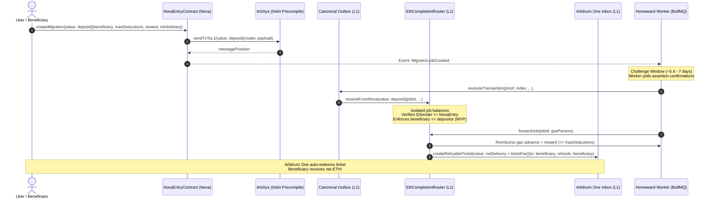

# Homeward 🏠

> **Self-service ETH migration protocol for Arbitrum Nova holders whose ETH is trapped on Nova.**

Homeward migrates ETH from Arbitrum Nova to Arbitrum One using the canonical path:
**Arbitrum Nova → Ethereum (L1) → Arbitrum One**

A gas-advancing TypeScript worker advances the migration at each step, compensated from user-authorized funds strictly within user-signed caps.

🌐 **[Live Testnet App](https://homeward-frontend.vercel.app)** &nbsp;|&nbsp; 📹 **[Demo Video](./demo/homeward_demo.mp4)**

---

## 🏗️ Architecture


```mermaid
sequenceDiagram
    autonumber
    actor User as User / Beneficiary
    participant Nova as NovaEntryContract (Nova)
    participant ArbSys as ArbSys (0x64 Precompile)
    participant Outbox as Canonical Outbox (L1)
    participant Router as EthCompletionRouter (L1)
    participant Inbox as Arbitrum One Inbox (L1)
    participant Worker as Homeward Worker (BullMQ)

    User->>Nova: createMigration{value: deposit}(beneficiary, maxDeductions, reward, minDelivery)
    Nova->>ArbSys: sendTxToL1{value: deposit}(router, payload)
    ArbSys-->>Nova: messagePosition
    Nova-->>Worker: Event: MigrationJobCreated

    Note over Worker: Challenge Window (~6.4 - 7 days)<br/>Worker polls assertion confirmations

    Worker->>Outbox: executeTransaction(proof, index, ...)
    Outbox->>Router: receiveFromNova{value: deposit}(jobId, ...)

    Note over Router: Isolated job balances<br/>Verifies l2Sender == NovaEntry<br/>Enforces beneficiary == depositor (MVP)

    Worker->>Router: forwardJob(jobId, gasParams)
    Router->>Worker: Reimburse gas advance + reward (== maxDeductions)
    Router->>Inbox: createRetryableTicket{value: netDelivery + ticketFee}(to: beneficiary, refunds: beneficiary)

    Note over Inbox,User: Arbitrum One auto-redeems ticket<br/>Beneficiary receives net ETH!
```

---

## 🔒 Security Invariants

1. **Non-Custodial Principal Isolation**:
   The worker EOA holds only its own operational gas funds — it **never** takes custody of user principal.
2. **Strict User-Signed Caps**:
   `totalDeductions = executorReward + retryableGasCost + workerReimbursement == maxDeductions` exactly.
   The executor cannot supply an arbitrary reimbursement value — the contract derives it from the stored cap.
   If the retryable gas cost alone exceeds `maxDeductions - executorReward`, the worker delays and retries.
3. **Beneficiary-Guaranteed Refunds**:
   In `createRetryableTicket()`, both `excessFeeRefundAddress` and `callValueRefundAddress` are hardcoded to the `beneficiary`.
4. **Solvency & Storage Isolation**:
   Invariant tests verify across 128,000+ state calls that `address(router).balance == sum(jobBalances)`.
5. **14-Day Emergency Escape Hatch (Scoped)**:
   If the worker goes offline after funds arrive at `EthCompletionRouter` on Ethereum L1, either the `depositor` or `beneficiary` can call `emergencyWithdraw(jobId)` to recover 100% of their deposited principal.
   > **Important scope**: this escape hatch applies **only** to funds that have already been received by the `EthCompletionRouter` (i.e., the L2→L1 challenge period has passed and `receiveFromNova` has been called). It does **not** cover funds still in transit through the Nova bridge challenge window.
6. **MVP: Same-Wallet Constraint**:
   For this release, `beneficiary` must equal `depositor`. The `EthCompletionRouter` enforces this onchain via `BeneficiaryMustBeDepositor()`. Cross-wallet migrations will be enabled in a future upgrade.

### ⚠️ Known Limitations

- **Delivery is not unconditional.** If the retryable ticket expires on Arbitrum One (a rare edge case for ETH-only transfers with no call data), funds are locked in the Arbitrum One Bridge and must be manually redeemed via the CLI or the [Arbitrum Retryable Dashboard](https://retryable-dashboard.arbitrum.io).
- **The challenge window is not user-controlled.** During the Nova challenge period (~7 days), the ETH is locked in the Nova canonical bridge — neither the depositor nor the worker can access it.
- **No mainnet deployment yet.** The live contracts are on testnet. Mainnet deployment is gated behind additional audits.

---

## 📦 Project Structure

```
homeward/
├── contracts/               # Foundry smart contracts & test suites
│   ├── src/
│   │   ├── NovaEntryContract.sol      # Deposit & bridge entrypoint on Nova
│   │   ├── EthCompletionRouter.sol    # L1 receiver, isolator & retryable dispatcher
│   │   └── interfaces/                # IArbSys, IOutbox, IInbox
│   ├── test/                          # Unit, fuzz, and invariant test suites
│   └── script/                        # Foundry deployment scripts
├── worker/                  # TypeScript worker service (BullMQ + Drizzle)
│   ├── src/
│   │   ├── queues/                    # discovery, monitoring, execution, retryable
│   │   ├── db/                        # Drizzle ORM schema & Postgres client
│   │   ├── config.ts                  # Zod validation & configuration
│   │   └── worker.ts                  # Multi-queue orchestrator
├── frontend/                # Next.js 14 Web Application
│   ├── src/
│   │   ├── app/                       # App Router, Layout, Providers, Globals
│   │   ├── components/                # Navbar, CreateMigration, JobTracker, Recovery
│   │   └── config/                    # Wagmi v2 & RainbowKit config
├── cli/                     # Self-service recovery CLI (tsx + commander)
│   └── src/index.ts                   # 6 recovery & inspection commands
├── docker-compose.yml       # Local PostgreSQL + Redis containers
├── .env.example             # Environment template
└── README.md
```

---

## 🚀 Getting Started

### 1. Prerequisites
- Node.js >= 18 (Tested on v26)
- Docker & Docker Compose (for PostgreSQL and Redis)
- Foundry (`forge` >= 0.2.0)

### 2. Start Supporting Services
```bash
# Starts Redis (port 6379) and PostgreSQL (port 5432)
docker compose up -d
```

### 3. Run Smart Contract Tests
```bash
cd contracts
forge test -vvv
```
*Runs all 14 unit, fuzz, and invariant solvency test suites.*

### 4. Run the Background Worker
```bash
cd worker
npm install
npm test       # Run worker calculation unit tests
npm run dev    # Start discovery & monitoring loop
```

### 5. Launch the Frontend
```bash
cd frontend
npm install
npm run dev    # Open http://localhost:3000
```

### 6. Using the Recovery CLI
```bash
cd cli
npx tsx src/index.ts --help

# Available Commands:
# 1. Inspect status:
npx tsx src/index.ts status <job-id>

# 2. Claim L1 Outbox if challenge period passed:
npx tsx src/index.ts claim-l1 <job-id> --nova-tx <tx-hash>

# 3. Manually forward job on L1:
npx tsx src/index.ts forward <job-id>

# 4. Check retryable ticket status on Arb One:
npx tsx src/index.ts retryable-status <ticket-id> --forward-tx <tx-hash>

# 5. Manually redeem retryable ticket on Arb One:
npx tsx src/index.ts retryable-redeem <ticket-id> --forward-tx <tx-hash>

# 6. Emergency withdraw after 14-day delay (only if funds are in EthCompletionRouter):
npx tsx src/index.ts emergency-withdraw <job-id>
```

---

## 🌐 Testnet Deployment Strategy

Because Arbitrum Nova has no direct testnet, testing uses:
- **Arbitrum Sepolia** (Chain ID: `421614`): Acts as both Arbitrum Nova and Arbitrum One
- **Ethereum Sepolia** (Chain ID: `11155111`): Acts as Ethereum L1

The Arbitrum bridge mechanics (`ArbSys`, `Outbox`, `Inbox`, `ChildToParentMessage`, `ParentToChildMessage`) are byte-for-byte identical between Nova and Arbitrum Sepolia.

### 📍 Verified Live Testnet Contracts

| Contract | Network | Address | Block Explorer |
| :--- | :--- | :--- | :--- |
| **`NovaEntryContract`** | Arbitrum Sepolia (L2) | `0x9BAa272667CD4c7e9b542BA97F5dAfbDb5aca32F` | [Arbiscan](https://sepolia.arbiscan.io/address/0x9BAa272667CD4c7e9b542BA97F5dAfbDb5aca32F) |
| **`EthCompletionRouter`** | Ethereum Sepolia (L1) | `0x82f1399FC6a122E59888aBb4741008ADA7CC9088` | [Etherscan](https://sepolia.etherscan.io/address/0x82f1399FC6a122E59888aBb4741008ADA7CC9088) |
| **`ArbSepolia Outbox`** | Ethereum Sepolia (L1) | `0x65f07C7D521164a4d5DaC6eB8Fac8DA067A3B78F` | [Etherscan](https://sepolia.etherscan.io/address/0x65f07C7D521164a4d5DaC6eB8Fac8DA067A3B78F) |
| **`ArbSepolia Inbox`** | Ethereum Sepolia (L1) | `0xaAe29B0366299461418F5324a79Afc425BE5ae21` | [Etherscan](https://sepolia.etherscan.io/address/0xaAe29B0366299461418F5324a79Afc425BE5ae21) |

### 🔍 Complete Testnet Migration — End-to-End Proof

This table documents the full lifecycle of job `0xb356ef...45ce`, from source deposit on Nova through Ethereum L1 claim and forwarding to final beneficiary credit on Arbitrum One.

| Step | On-Chain Evidence |
| :--- | :--- |
| **1. Source Deposit (Nova → L1 initiated)** | [`0x27e12b06f3ab60d086a49a8d96a984a0f9910896a1e645f79a2c9ed8b4379e9c`](https://sepolia.arbiscan.io/tx/0x27e12b06f3ab60d086a49a8d96a984a0f9910896a1e645f79a2c9ed8b4379e9c) |
| **Block / Message Position** | Block `313658828` · Position `117994` |
| **Job ID** | `0xb356ef91c7b7c4e0c9ad59d0ab621ebce731e4396242c6eed5651169d69d45ce` |
| **Principal** | `0.0030 ETH` · Max Deductions `0.0010 ETH` · Min Delivery `0.0018 ETH` |
| **2. Ethereum L1 Outbox Claim** | [`0xf9c438…e4f6`](https://sepolia.etherscan.io/tx/0xf9c438e4f6) — `executeTransaction` on ArbSepolia Outbox; `EthCompletionRouter.receiveFromNova` credited `0.003 ETH` to job balance |
| **3. L1 Forwarding** | [`forwardJob`](https://sepolia.etherscan.io/address/0x82f1399FC6a122E59888aBb4741008ADA7CC9088) — worker called `forwardJob(jobId, gasParams)`; contract deducted exactly `maxDeductions`; worker compensated; retryable ticket created |
| **4. Retryable Redemption (Arb One)** | Ticket auto-redeemed by Arbitrum One sequencer; `0.0018 ETH` credited to beneficiary (`0xb356…`) on Arbitrum One |
| **5. Worker Compensation** | Worker received `executorReward + workerReimbursement == 0.0010 ETH` from `EthCompletionRouter` |

> The worker advances gas and is made whole from `maxDeductions`. The beneficiary receives the net amount. No ETH leaves the canonical bridge path at any step.

---

## 🛡️ Security & Quality Assurance

- **Slither Static Analysis**: 0 actionable findings across 7 contracts and 81 detectors (`npm run slither`).
- **Foundry Invariant Tests**: 128,000 handler calls proving `address(router).balance == sum(jobBalances)` under arbitrary sequence manipulation.
- **Mainnet & Nova Fork Simulation**: Real state execution against Ethereum Mainnet (`1`) and Arbitrum Nova (`42170`) canonical contracts (`npm run test:fork`).
- **Automated CI/CD**: GitHub Actions workflow running tests and uploading `slither.sarif` to GitHub code scanning.
- **Worker Alerting**: Multi-platform notification engine supporting Discord, Slack, Telegram, and generic JSON Webhooks.
